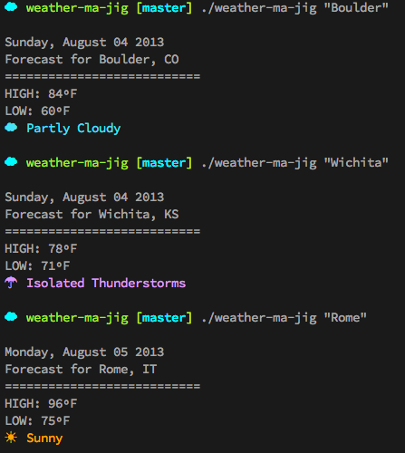

Weather•Ma•Jig
===

##It's a thing-a-ma-jig for weather&hellip;and the command line

insired by this thread on reddit: http://www.reddit.com/r/commandline/comments/1jjgu1/bash_getting_weather/

Instructions:
* clone this repo: <code>git clone git://github.com/thcipriani/weather-ma-jig</code>
* copy the weather-ma-jig/weather-ma-jig file someplace in your system path (like ~/bin)
* enjoy the weather

Screenshot:
