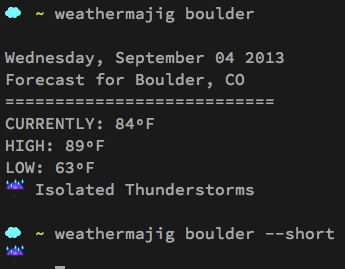

Weather•Ma•Jig
===

##It's a thing-a-ma-jig for weather&hellip;and the command line

insired by this thread on reddit: http://www.reddit.com/r/commandline/comments/1jjgu1/bash_getting_weather/

Instructions:
---
* Get an app id from yahoo: https://developer.apps.yahoo.com/wsregapp/
* clone this repo: <code>git clone git://github.com/thcipriani/weather-ma-jig</code>
* put your app id in the weather-ma-jig script on line 10 (the variable APPID)
* make weather-ma-jig executable <code>chmod a+x weather-ma-jig/weather-ma-jig</code>
* copy the weather-ma-jig/weather-ma-jig file someplace in your system path (like ~/bin): <code>cp weather-ma-jig/weather-ma-jig ~/bin/</code>
* enjoy the weather

Screenshot:
---

Here's what this looks like running on a non-mac:

Sweet Emoji on Mac!
